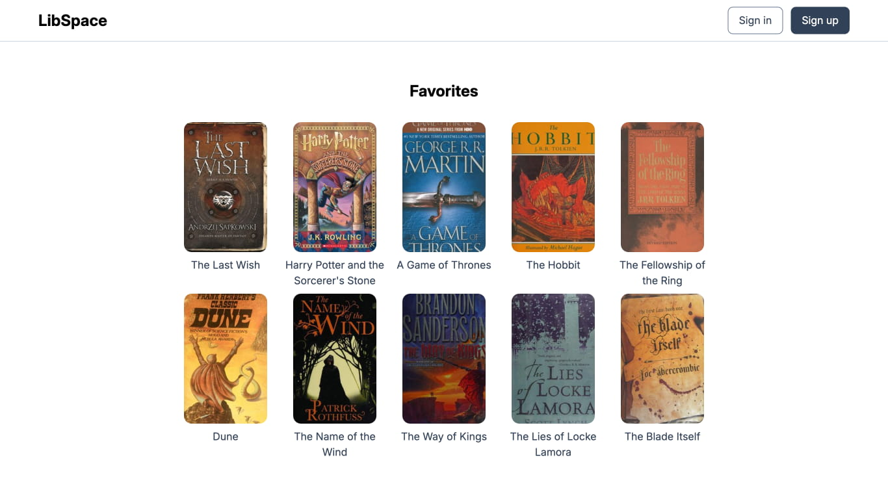

# LibSpace

A social reading platform for discovering, tracking, and discussing your favorite books.

[Live Demo](http://libspace.netlify.app)



## Project Goals

This project was built to explore a **server-first, progressively enhanced** architecture for modern web applications. The key objectives were:

- **Minimize Client-Side Complexity:** Build a robust and secure application by handling authentication, sessions, and data mutations almost entirely on the server.
- **Embrace Progressive Enhancement:** Ensure the core experience is functional with zero JavaScript, while layering on modern, real-time features for capable browsers.
- **Prioritize Developer Experience:** Leverage end-to-end type safety and a component-based architecture to create a maintainable and scalable codebase.

## Getting Started

### Prerequisites

- **Bun:** This project uses Bun as its runtime and package manager. You can find installation instructions at https://bun.sh.

### Installation

1.  Clone the repository:
    ```bash
    git clone https://github.com/wtchnm/LibSpace.git
    ```
2.  Navigate to the project directory:
    ```bash
    cd libspace
    ```
3.  Install the dependencies:
    ```bash
    bun install
    ```
4.  Run the development server:
    ```bash
    bun run dev
    ```

## Tech Stack

- **Astro 5** - Live Collections & Server Actions
- **Better Auth** - Server-side authentication
- **Astro DB** - Turso/SQLite persistence
- **Open Library API** - Book data integration
- **Tailwind CSS v4** + TypeScript

## Features

### ✅ Completed

- **Server-side authentication** - Pure server-side forms and sessions
- **Type-safe actions** - Full TypeScript form validation
- **Live content collections** - Dynamic book data loading
- **Progressive enhancement** - JavaScript-optional by design
- **Performance optimization** - Intelligent caching and lazy loading

### 🚧 Planned

- **PWA capabilities** - Offline support and app-like experience
- **User profiles** - Personal shelves and reading progress
- **Search functionality** - Find books by title, author, or ISBN
- **Social features** - Reviews, recommendations, and reading lists

## Contributing

Contributions are welcome! Please feel free to submit a pull request or open an issue.

## License

MIT
